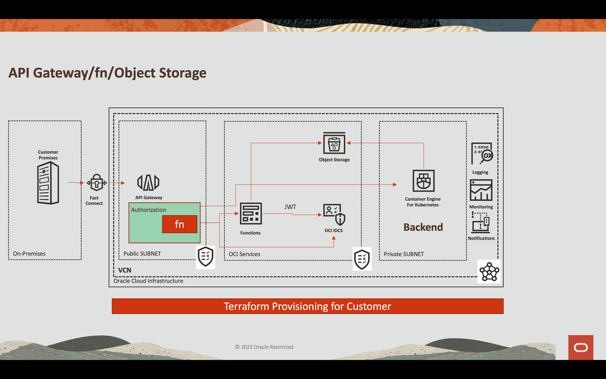
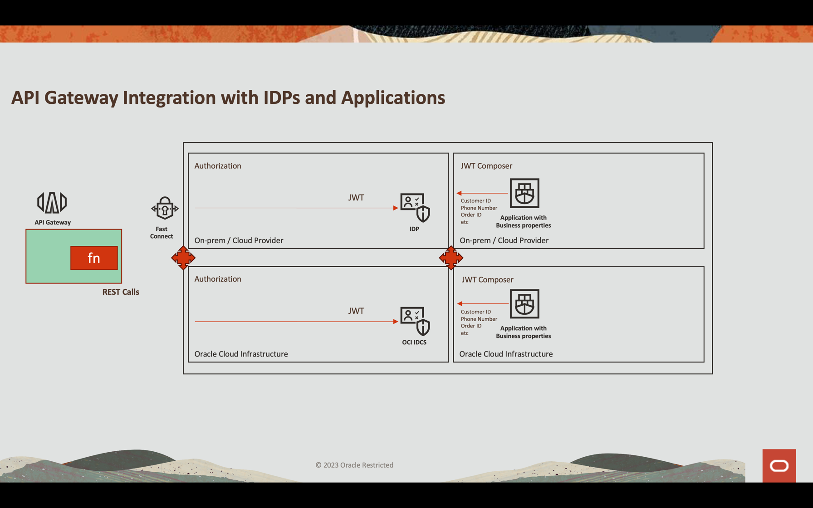
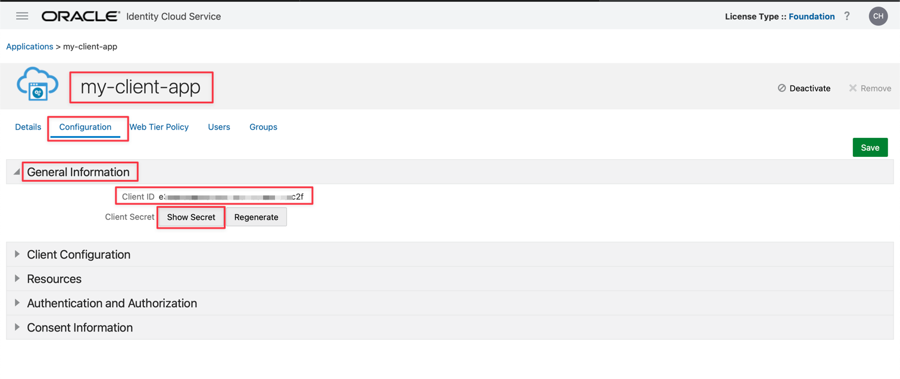
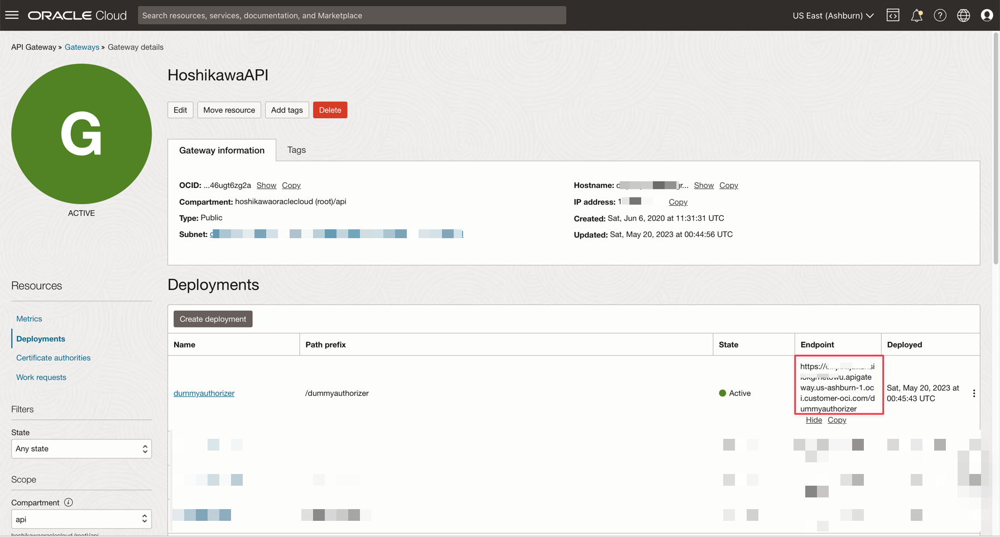
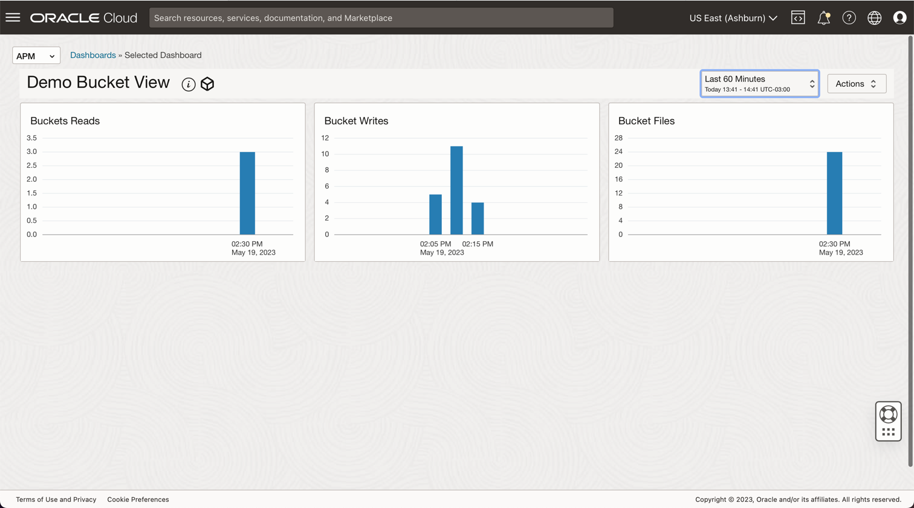

# Use Oracle Cloud API Gateway to create a secure Object Storage download service with a function authentication

### Introduction

Oracle Cloud Object Storage is a very cheap and effective way to store large or small files.
In our demo, we will show how to configure Oracle API Gateway to implement a REST service through a function that allows, in a flexible way, to authenticate a JWT token through an external Identity Provider or the OCI itself (IDCS). Regardless of the process, you can validate the JWT token (since an attribute can be part of the file name), use OCI services through its SDK and other customizable processes.
Furthermore, Object Storage allows working in an Event-Driven architecture, making the process execution near to real-time. You can configure events in Object Storage to trigger events, and you can also create REST services to securely, quickly, and inexpensively write to or read files from Object Storage. If you are interested in seeing how to implement an event-driven architecture see [Process large files in Autonomous Database and Kafka with Oracle Cloud Infrastructure Data Flow](https://docs.oracle.com/en/learn/oci-dataflow-adw-kafka/#introduction) 



### Objectives

The objective of this demo is:

- Expose an API REST service to download a file from Object Storage in a safe way
- Using OCI API Gateway authenticating with OCI function
- Return a pre-authenticated link with a 60 seconds limit time for download
- Configure an Observability to monitor the file writes and reads

### Prerequisites

You need:
- An OCI Object Storage bucket created and configured with policies you need to write and read files (see in the References section [Object Storage Security](https://docs.oracle.com/en-us/iaas/Content/Security/Reference/objectstorage_security.htm))
- An operational Oracle Cloud tenant: You can create a free Oracle Cloud account with US$ 300.00 for a month to try this tutorial. See [Create a Free Oracle Cloud Account](https://www.oracle.com/cloud/free/)
- OCI CLI (Oracle Cloud Command Line Interface) installed on your local machine: This is the link to install the [OCI CLI](https://docs.oracle.com/en-us/iaas/Content/API/SDKDocs/cliinstall.htm).
- An OCI Functions and the Policies configured for development (the example was implemented in Python, see the References section to configure fn and policies in [Functions QuickStart Guides](https://docs.oracle.com/en-us/iaas/Content/Functions/Tasks/functionsquickstartguidestop.htm))
- An OCI API Gateway instance created and exposed to the Internet (there is a tutorial in References section to configure policies and instance for the API Gateway in [Creating Your First API Gateway In The Oracle Cloud](https://blogs.oracle.com/developers/post/creating-your-first-api-gateway-in-the-oracle-cloud))
- Access to your OCI IDCS

### Task 1: Configure an application in IDCS

You can configure any REST API External Identity Provider to work with JWT like **Auth0** and **OCI IDCS**.
In this demo, we will work with **OCI IDCS** and call the authentication inside the function.
Basically, you need to create an Application in the IDCS, in the example, called **my-client-app**. You need to select **Client Credentials** and **JWT Assertion** options.
Visit the References section [Protect Apis with API Gateway using IDCS/IAM JWT with Scopes and Claims](https://blogs.oracle.com/coretec/post/protect-apis-with-api-gateway-using-idcsiam-jwt-with-scopes-and-claims) to view how to configure with more details. 


Save and activate your application. You can get the **clientID** and **secretID** to use in the next section.



### Task 2: Review the code

This is the entire function python code used in an API Gateway deployment to 

* Authorize a pre-authenticate link to download a file in the Object Storage

You can download the Python code here: [Python fn Project](./python-demo-fn-code.zip)

```python
import io
import json
import logging
import datetime
import jwt
import requests
import base64
import oci

from datetime import timedelta
from fdk import response
from py_zipkin import Encoding #import Zipkin package
from py_zipkin.zipkin import zipkin_span #import Zipkin package
from transport import http_transport #import Zipkin transport

@zipkin_span(service_name='statusGetFile', span_name='statusGetFile')
def handler(ctx, data: io.BytesIO = None):
    with zipkin_span(
            service_name="Status: Load File", #You can change it as you need
            span_name=json.loads(data.getvalue()).get("objectID"), #You can change it as you need
            transport_handler=http_transport, #zipkin transport, will use it to upload trace data to OCI APM
            encoding = Encoding.V2_JSON,
            binary_annotations = {"get":data.getvalue()}, #Custom tag
            sample_rate=100 # this is optional and can be used to set custom sample rates
    ):

        auth_token = "invalid"
        token = "invalid"
        apiKey = "invalid"
        expiresAt = (datetime.datetime.utcnow() + timedelta(seconds=60)).replace(tzinfo=datetime.timezone.utc).astimezone().replace(microsecond=0).isoformat()

        config = oci.config.from_file("config")
        object_storage = oci.object_storage.ObjectStorageClient(config)
        namespace = object_storage.get_namespace().data

        try:
            auth_token = json.loads(data.getvalue())
            secretID = auth_token.get("secretID")
            clientID = auth_token.get("clientID")
            objectID = auth_token.get("objectID")

            preauthstr = str(preauth.data)

            auth = clientID + ":" + secretID
            auth_bytes = auth.encode("ascii")
            auth_base64_bytes = base64.b64encode(auth_bytes)
            auth_base64_message = auth_base64_bytes.decode("ascii")

            headers = {"Authorization": "Basic " + auth_base64_message, "Content-Type": "application/x-www-form-urlencoded"}

            scope = "xxxxxxxxxxxxxxxxxxxx.apigateway.us-ashburn-1.oci.customer-oci.com/super-scope"
            grant_type = "client_credentials"

            body = {"scope": scope, "grant_type": grant_type}

            url_post = "https://idcs-xxxxxxxxxxxxxxxxxxxxxxx.identity.oraclecloud.com/oauth2/v1/token"
            post_response = requests.post(url_post, headers=headers, data=body)

            jwtTokenDecoded = jwt.decode(post_response.json()['access_token'], options={"verify_signature": False})

            return response.Response(
                ctx,
                status_code=200,
                response_data=json.dumps({"active": True, "principal": "foo", "scope": "bar", "clientId": "1234", "expiresAt": expiresAt, "context": {"username": "wally", "token": post_response.json()['access_token'], "jwtTokenDecoded": jwtTokenDecoded, "objectID": preauthstr}})
            )

        except (Exception, ValueError) as ex:
            logging.getLogger().info('error parsing json payload: ' + str(ex))
            pass

        return response.Response(
            ctx,
            status_code=401,
            response_data=json.dumps({"active": False, "wwwAuthenticate": "API-key"})
        )


```

Let's analyze the code in parts to understand

* How to follow the processes in the OCI Observability
* How to configure a pre-authenticate link to download a file in the Object Storage
* How to authenticate with a Identity Provider and obtain a JWT token
* How to decode a JWT token and use the information in the process
* How to return a success or fail status in the API Gateway deployment

This part of code saves a status position in **OCI Observability**. It uses **Zipkin** framework to publish into **OCI APM Observability**

```python
@zipkin_span(service_name='statusGetFile', span_name='statusGetFile')
def handler(ctx, data: io.BytesIO = None):
    with zipkin_span(
            service_name="Status: Load File", #You can change it as you need
            span_name=json.loads(data.getvalue()).get("objectID"), #You can change it as you need
            transport_handler=http_transport, #zipkin transport, will use it to upload trace data to OCI APM
            encoding = Encoding.V2_JSON,
            binary_annotations = {"get":data.getvalue()}, #Custom tag
            sample_rate=100 # this is optional and can be used to set custom sample rates
    ):

```

This is the **OCI APM Console** view for the code.
And you can find your files with queries like:

- **ServiceName** = 'Status: Load File' and **OperationName** = '50 - DR-HA OIC.pdf'


The next code stablishes an expiration date and time for the **Object Storage** file. A pre-authenticate will be generated and the attribute **expiresAt** will be used for this objective. **timedelta** add 60 seconds from the current time for downloading the file.

```python
expiresAt = (datetime.datetime.utcnow() + timedelta(seconds=60)).replace(tzinfo=datetime.timezone.utc).astimezone().replace(microsecond=0).isoformat()
```

Now, we need to initialize the **OCI Object Storage framework** based on the credentials saved in the **OCI CLI** installation.
The OCI CLI configuration uses the **~/.oci/config** and the certificate **.pem** file. So you can install OCI CLI locally and configure a user to access the Object Storage (see the OCI documentation to install OCI CLI and the Object Storage policies in the References section) and then, copy these 2 files into this **fn** project. 

```python
config = oci.config.from_file("config")
object_storage = oci.object_storage.ObjectStorageClient(config)
namespace = object_storage.get_namespace().data
```

The next step will get from the **Body** parameters values: **secretID**, **clientID** and **objectID**.

    #secretID = the IDCS secretID from the application created to validate the JWT Token
    #clientID = the IDCS clientID from the application created to validate the JWT Token
    #objectID = the file name in the Object Storage 

```python
try:
    auth_token = json.loads(data.getvalue())
    secretID = auth_token.get("secretID")
    clientID = auth_token.get("clientID")
    objectID = auth_token.get("objectID")
```

The [OCI SDK](https://docs.oracle.com/en-us/iaas/tools/python/latest/api/object_storage.html) can support the Object Storage for many services, like read and/or write a file, list content of a bucket and others. You can, for example, enable the consumer to list all the content of a bucket with:
A pre-authenticated **URL** will be generated in this part of code. The variable **bucket_name** contains the name of the bucket in the **Object Storage** created previously and **time_expires** represents the date and time expiration to download the file.

```python
details = oci.object_storage.models.CreatePreauthenticatedRequestDetails(name="data", access_type="AnyObjectReadWrite", bucket_listing_action="ListObjects", time_expires=expiresAt)

preauth = object_storage.create_preauthenticated_request(namespace_name=namespace, bucket_name="data", create_preauthenticated_request_details=details)
preauthstr = str(preauth.data)
```

This part of code calls the **IDCS** to validate **clientID** and **secretID** to obtain the **JWT** token. A JWT can be decoded into a JSON string, in this case, without signature, but the signature can be verified easily with a certificate. 

```python
auth = clientID + ":" + secretID
auth_bytes = auth.encode("ascii")
auth_base64_bytes = base64.b64encode(auth_bytes)
auth_base64_message = auth_base64_bytes.decode("ascii")

headers = {"Authorization": "Basic " + auth_base64_message, "Content-Type": "application/x-www-form-urlencoded"}

scope = "xxxxxxxxxxxxxxxxxxxx.apigateway.us-ashburn-1.oci.customer-oci.com/super-scope"
grant_type = "client_credentials"

body = {"scope": scope, "grant_type": grant_type}

url_post = "https://idcs-xxxxxxxxxxxxxxxxxxxxxxx.identity.oraclecloud.com/oauth2/v1/token"
post_response = requests.post(url_post, headers=headers, data=body)

jwtTokenDecoded = jwt.decode(post_response.json()['access_token'], options={"verify_signature": False})

```

This is the final part, where all the data will be returned with code **200**. You can return all the information needed to your application and these part of code validates the authentication or not, resulting in code 200 (authorized/success) or 401 (unauthorized).

```python
    return response.Response(
        ctx,
        status_code=200,
        response_data=json.dumps({"active": True, "principal": "foo", "scope": "bar", "clientId": "1234", "expiresAt": expiresAt, "context": {"username": "wally", "token": post_response.json()['access_token'], "jwtTokenDecoded": jwtTokenDecoded, "objectID": preauthstr}})
    )

except (Exception, ValueError) as ex:
    logging.getLogger().info('error parsing json payload: ' + str(ex))
    pass

return response.Response(
    ctx,
    status_code=401,
    response_data=json.dumps({"active": False, "wwwAuthenticate": "API-key"})
)


```

### Task 3: Configure the OCI API Gateway to authenticate with fn

OCI API Gateway can deploy an API as a OCI function. As you saw previously, the code uses the **body** containing **clientID**, **secretID** and **objectID** information passed by API Gateway configuration. You can configure your deployment:


After save your deployment, you can get the REST endpoint here. Remember that the complete endpoint for your Object Storage REST API service is this endpoint plus the "/" at the end (you declared / as your path previously)



### Task 4: Test the API Gateway Deployment

You can test the application with **CURL** or in **Postman**:

```bash
curl --location 'https://xxxxxxxxxxxxxxxxxxx.apigateway.us-ashburn-1.oci.customer-oci.com/dummyauthorizer/' \
--header 'Content-Type: text/plain' \
--data '{"clientID": "e3exxxxxxxxxxxxxxxxxc2f", "secretID": "8exxxxxxx-fa5e-xxcf-8xxxc-xxxxxxxxxxx87"}'
```


If everything is OK, you can see the success code 200:


An **URL** for the pre-authenticated Object Storage will be generated and you can download the file for the next 60 seconds.
You can download the file following the example:

    https://objectstorage.us-ashburn-1.oraclecloud.com + [access_uri]

    or

    https://objectstorage.us-ashburn-1.oraclecloud.com/p/eL5C0R0luN_cTNn-vUF7_Dx_z2N4w7IXemKr5y61cSRxZZPRXcR2Yj1dNCaJBDK8/n/idavixsf5sbx/b/data/o/calico.yaml

    So you can download, upload or view the bucket files with this command line:

    TO UPLOAD A FILE
    curl https://objectstorage.us-ashburn-1.oraclecloud.com/p/HoPudIF45Bj6J5-Qy3J1D9dOplLuKtECRFhvOTkKAtBjJXkOTDx0Pt8gXbOOEoRx/n/idavixsf5sbx/b/data/o/ --upload-file func.py
    
    TO DOWNLOAD A FILE
    curl https://objectstorage.us-ashburn-1.oraclecloud.com/p/3ZyXd6PchrTFrp1oxmedamSG1ojwQa3BxPUyonAA-q1mf3QAe5STpDrt89eYITPf/n/idavixsf5sbx/b/data/o/func.py
    
    TO LIST BUCKET
    curl https://objectstorage.us-ashburn-1.oraclecloud.com/p/ODVRMB71kD0SHWuoY4ojVd93nmIiy8u0zrxA56T7FBaohAgA7k8KOLAIlhxjcveE/n/idavixsf5sbx/b/data/o/ 

### Task 5: Observability

Basically, every OCI resource can show metrics in a dashboard and many events on these resources can trigger an action.
So, in this demo, you can configure a dashboard to show how many files have been written or read on the Object Storage:



You can configure the dashboard query like this:

- Bucket Files = **ObjectCount[1d].groupby(resourceID).count()**
- Bucket Writes = **PutRequests[5m].grouping().count()**
- Bucket Reads = **GetRequests[5m].grouping().count()**

### References
* [Install the OCI CLI](https://docs.oracle.com/en-us/iaas/Content/API/SDKDocs/cliinstall.htm)
* [Object Storage Security](https://docs.oracle.com/en-us/iaas/Content/Security/Reference/objectstorage_security.htm)
* [Creating Your First API Gateway In The Oracle Cloud](https://blogs.oracle.com/developers/post/creating-your-first-api-gateway-in-the-oracle-cloud)
* [Functions QuickStart Guides](https://docs.oracle.com/en-us/iaas/Content/Functions/Tasks/functionsquickstartguidestop.htm)
* [Oracle Functions Samples](https://github.com/oracle-samples/oracle-functions-samples)
* [Passing Tokens to Authorizer Functions to Add Authentication and Authorization to API Deployments](https://docs.oracle.com/en-us/iaas/Content/APIGateway/Tasks/apigatewayusingauthorizerfunction.htm)
* [Create a JWT Token in Java for Oracle IDCS](https://www.ateam-oracle.com/post/create-a-jwt-token-in-java-for-oracle-idcs)
* [Object Storage Metrics](https://docs.oracle.com/pt-br/iaas/Content/Object/Reference/objectstoragemetrics.htm)
* [Monitoring Query Language (MQL) Reference](https://docs.oracle.com/pt-br/iaas/Content/Monitoring/Reference/mql.htm)
* [Protect Apis with API Gateway using IDCS/IAM JWT with Scopes and Claims](https://blogs.oracle.com/coretec/post/protect-apis-with-api-gateway-using-idcsiam-jwt-with-scopes-and-claims)
* [Process large files in Autonomous Database and Kafka with Oracle Cloud Infrastructure Data Flow](https://docs.oracle.com/en/learn/oci-dataflow-adw-kafka/#introduction)
### Acknowledgments

* **Author** - Cristiano Hoshikawa (Oracle LAD A-Team Solution Engineer)
