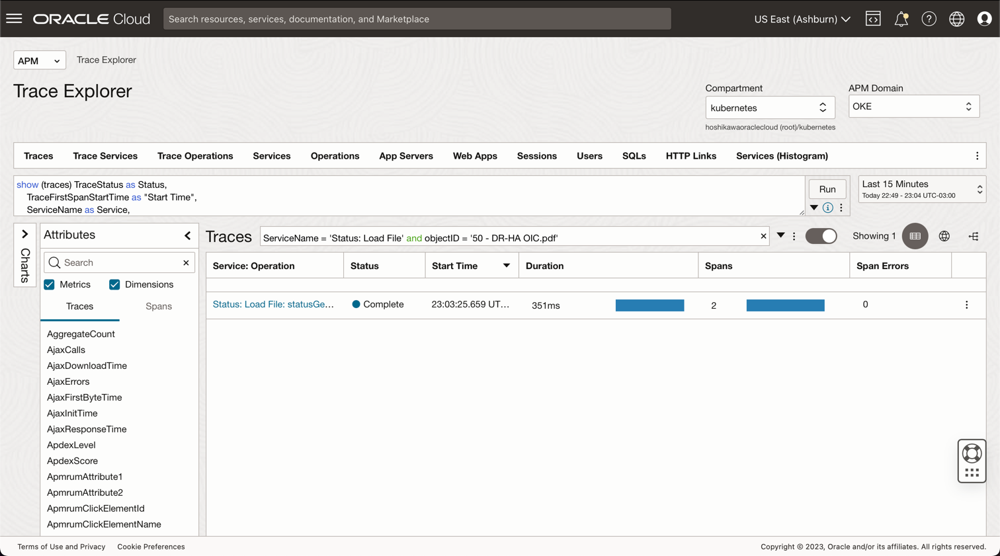
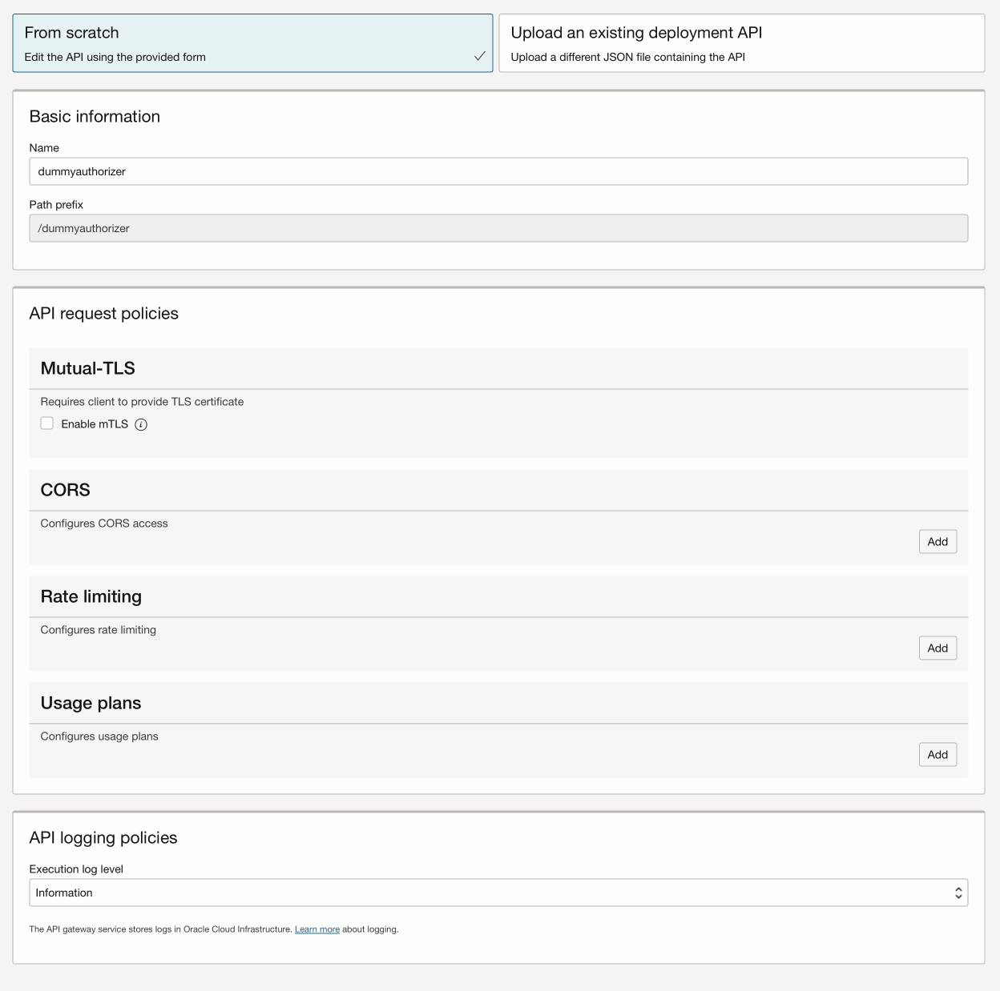
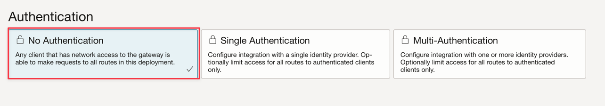
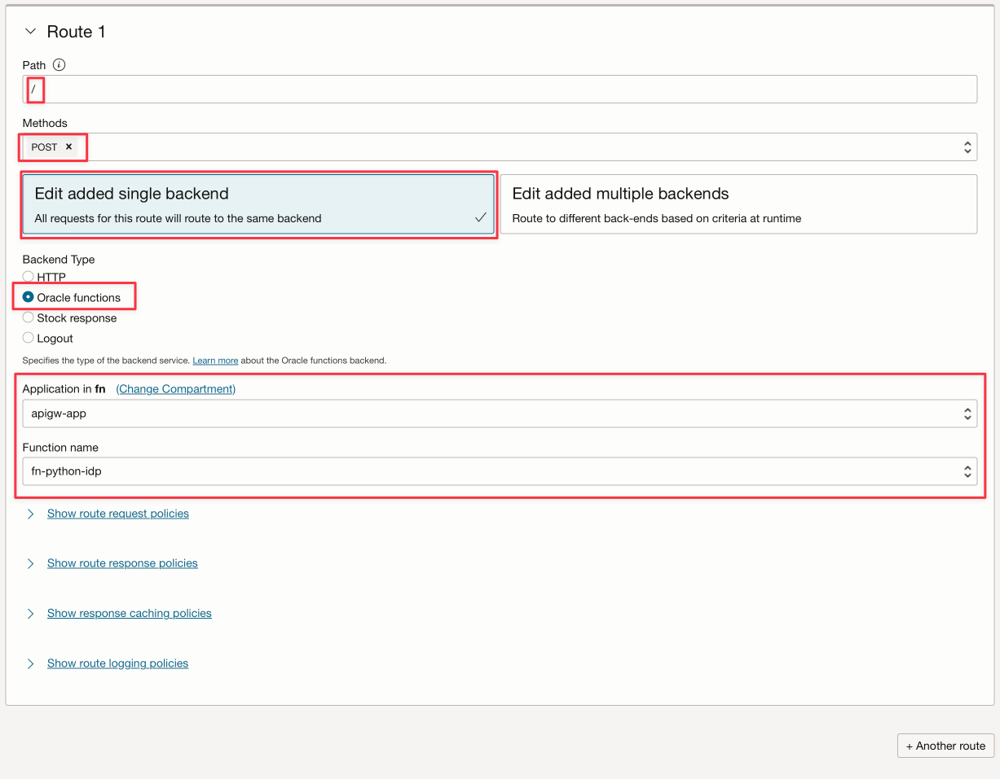
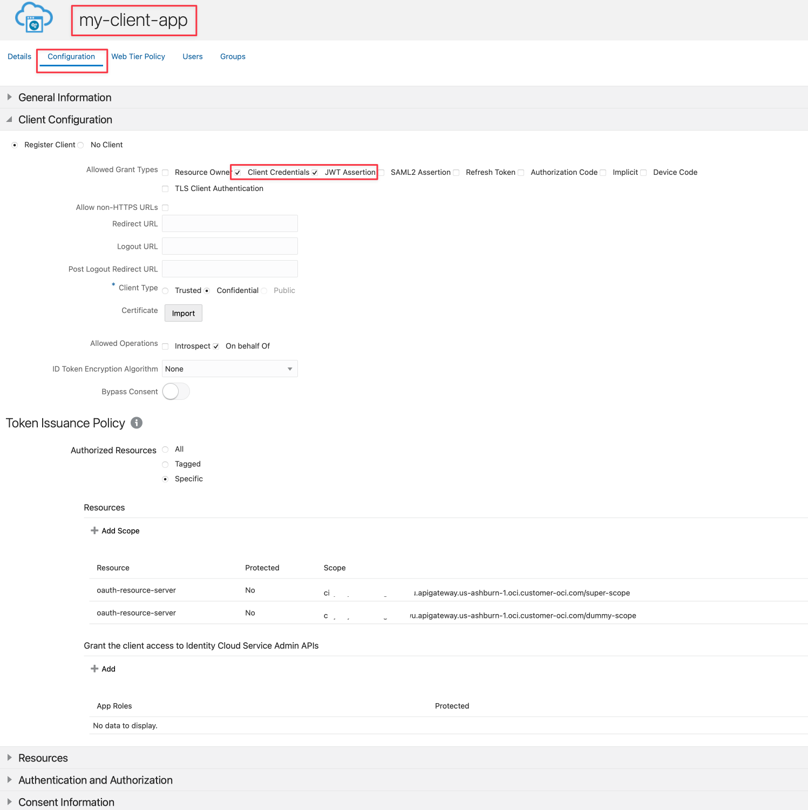
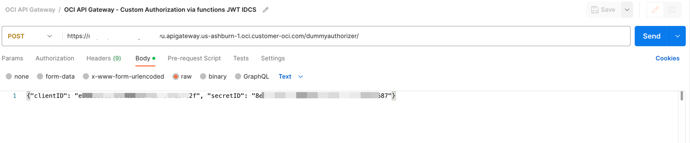
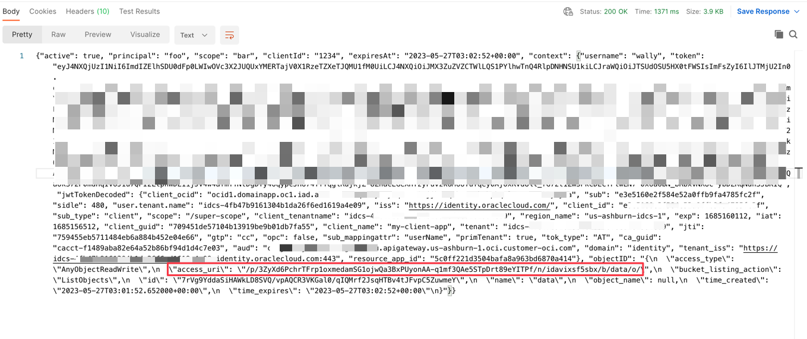

### Review the code

This is the entire function python code used in an API Gateway deployment to 

* Authorize a pre-authenticate link to download a file in the Object Storage

```python
import io
import json
import logging
import datetime
import jwt
import requests
import base64
import oci

from datetime import timedelta
from fdk import response
from py_zipkin import Encoding #import Zipkin package
from py_zipkin.zipkin import zipkin_span #import Zipkin package
from transport import http_transport #import Zipkin transport

@zipkin_span(service_name='statusGetFile', span_name='statusGetFile')
def handler(ctx, data: io.BytesIO = None):
    with zipkin_span(
            service_name="Status: Load File", #You can change it as you need
            span_name=json.loads(data.getvalue()).get("objectID"), #You can change it as you need
            transport_handler=http_transport, #zipkin transport, will use it to upload trace data to OCI APM
            encoding = Encoding.V2_JSON,
            binary_annotations = {"get":data.getvalue()}, #Custom tag
            sample_rate=100 # this is optional and can be used to set custom sample rates
    ):

        auth_token = "invalid"
        token = "invalid"
        apiKey = "invalid"
        expiresAt = (datetime.datetime.utcnow() + timedelta(seconds=60)).replace(tzinfo=datetime.timezone.utc).astimezone().replace(microsecond=0).isoformat()

        config = oci.config.from_file("config")
        object_storage = oci.object_storage.ObjectStorageClient(config)
        namespace = object_storage.get_namespace().data

        try:
            auth_token = json.loads(data.getvalue())
            secretID = auth_token.get("secretID")
            clientID = auth_token.get("clientID")
            objectID = auth_token.get("objectID")

            #get_obj = object_storage.get_object(namespace, "data", objectID)
            #objb64 = base64.b64encode(get_obj.data.content)
            #objstr = objb64.decode('utf-8')

            details = oci.object_storage.models.CreatePreauthenticatedRequestDetails(name=objectID, access_type="ObjectRead", object_name=objectID, time_expires=expiresAt)

            preauth = object_storage.create_preauthenticated_request(namespace_name=namespace, bucket_name="data", create_preauthenticated_request_details=details)
            preauthstr = str(preauth.data)

            auth = clientID + ":" + secretID
            auth_bytes = auth.encode("ascii")
            auth_base64_bytes = base64.b64encode(auth_bytes)
            auth_base64_message = auth_base64_bytes.decode("ascii")

            headers = {"Authorization": "Basic " + auth_base64_message, "Content-Type": "application/x-www-form-urlencoded"}

            scope = "xxxxxxxxxxxxxxxxxxxx.apigateway.us-ashburn-1.oci.customer-oci.com/super-scope"
            grant_type = "client_credentials"

            body = {"scope": scope, "grant_type": grant_type}

            url_post = "https://idcs-xxxxxxxxxxxxxxxxxxxxxxx.identity.oraclecloud.com/oauth2/v1/token"
            post_response = requests.post(url_post, headers=headers, data=body)

            jwtTokenDecoded = jwt.decode(post_response.json()['access_token'], options={"verify_signature": False})

            #return response.Response(
            #    ctx,
            #    status_code=200,
            #    response_data=json.dumps({"active": True, "principal": "foo", "scope": "bar", "clientId": "1234", "expiresAt": expiresAt, "context": {"username": "wally", "token": post_response.json()['access_token'], "jwtTokenDecoded": jwtTokenDecoded, "object": objstr}})
            # )
            return response.Response(
                ctx,
                status_code=200,
                response_data=json.dumps({"active": True, "principal": "foo", "scope": "bar", "clientId": "1234", "expiresAt": expiresAt, "context": {"username": "wally", "token": post_response.json()['access_token'], "jwtTokenDecoded": jwtTokenDecoded, "objectID": preauthstr}})
            )

        except (Exception, ValueError) as ex:
            logging.getLogger().info('error parsing json payload: ' + str(ex))
            pass

        return response.Response(
            ctx,
            status_code=401,
            response_data=json.dumps({"active": False, "wwwAuthenticate": "API-key"})
        )


```

Let's analyze the code in parts to understand

* How to follow the processes in the OCI Observability
* How to configure a pre-authenticate link to download a file in the Object Storage
* How to authenticate with a Identity Provider and obtain a JWT token
* How to decode a JWT token and use the information in the process
* How to return a success or fail status in the API Gateway deployment

This part of code saves a status position in **OCI Observability**. It uses **Zipkin** framework to publish into **OCI APM Observability**

```python
@zipkin_span(service_name='statusGetFile', span_name='statusGetFile')
def handler(ctx, data: io.BytesIO = None):
    with zipkin_span(
            service_name="Status: Load File", #You can change it as you need
            span_name=json.loads(data.getvalue()).get("objectID"), #You can change it as you need
            transport_handler=http_transport, #zipkin transport, will use it to upload trace data to OCI APM
            encoding = Encoding.V2_JSON,
            binary_annotations = {"get":data.getvalue()}, #Custom tag
            sample_rate=100 # this is optional and can be used to set custom sample rates
    ):

```

This is the **OCI APM Console** view for the code:



The next code stablishes an expiration date and time for the **Object Storage** file. A pre-authenticate will be generated and the attribute **expiresAt** will be used for this objective. **timedelta** add 60 seconds from the current time for downloading the file.

```python
        expiresAt = (datetime.datetime.utcnow() + timedelta(seconds=60)).replace(tzinfo=datetime.timezone.utc).astimezone().replace(microsecond=0).isoformat()
```

Now, we need to initialize the **OCI Object Storage framework** based on the credentials saved in the **OCI CLI** installation.
Save the **~/.oci/config** in this **fn** project. 

```python
        config = oci.config.from_file("config")
        object_storage = oci.object_storage.ObjectStorageClient(config)
        namespace = object_storage.get_namespace().data
```

The next step will get from the **Body** parameters values: **secretID**, **clientID** and **objectID**.

    #secretID = the IDCS secretID from the application created to validate the JWT Token
    #clientID = the IDCS clientID from the application created to validate the JWT Token
    #objectID = the file name in the Object Storage 

```python
        try:
            auth_token = json.loads(data.getvalue())
            secretID = auth_token.get("secretID")
            clientID = auth_token.get("clientID")
            objectID = auth_token.get("objectID")
```

A pre-authenticated **URL** will be generated in this part of code. The variable **bucket_name** contains the name of the bucket in the **Object Storage** created previously and **time_expires** represents the date and time expiration to download the file.

```python
            details = oci.object_storage.models.CreatePreauthenticatedRequestDetails(name=objectID, access_type="ObjectRead", object_name=objectID, time_expires=expiresAt)

            preauth = object_storage.create_preauthenticated_request(namespace_name=namespace, bucket_name="data", create_preauthenticated_request_details=details)
            preauthstr = str(preauth.data)

```

This part of code calls the **IDCS** to validate **clientID** and **secretID** to obtain the **JWT** token. A JWT can be decoded into a JSON string, in this case, without signature, but the signature can be verified easily with a certificate. 

```python
            auth = clientID + ":" + secretID
            auth_bytes = auth.encode("ascii")
            auth_base64_bytes = base64.b64encode(auth_bytes)
            auth_base64_message = auth_base64_bytes.decode("ascii")

            headers = {"Authorization": "Basic " + auth_base64_message, "Content-Type": "application/x-www-form-urlencoded"}

            scope = "xxxxxxxxxxxxxxxxxxxx.apigateway.us-ashburn-1.oci.customer-oci.com/super-scope"
            grant_type = "client_credentials"

            body = {"scope": scope, "grant_type": grant_type}

            url_post = "https://idcs-xxxxxxxxxxxxxxxxxxxxxxx.identity.oraclecloud.com/oauth2/v1/token"
            post_response = requests.post(url_post, headers=headers, data=body)

            jwtTokenDecoded = jwt.decode(post_response.json()['access_token'], options={"verify_signature": False})

```

This is the final part, where all the data will be returned with code **200**. You can return all the information needed to your application and these part of code validates the authentication or not, resulting in code 200 (authorized/success) or 401 (unauthorized).

```python
            return response.Response(
                ctx,
                status_code=200,
                response_data=json.dumps({"active": True, "principal": "foo", "scope": "bar", "clientId": "1234", "expiresAt": expiresAt, "context": {"username": "wally", "token": post_response.json()['access_token'], "jwtTokenDecoded": jwtTokenDecoded, "objectID": preauthstr}})
            )

        except (Exception, ValueError) as ex:
            logging.getLogger().info('error parsing json payload: ' + str(ex))
            pass

        return response.Response(
            ctx,
            status_code=401,
            response_data=json.dumps({"active": False, "wwwAuthenticate": "API-key"})
        )


```

### Configure the OCI API Gateway to authenticate with fn

OCI API Gateway can deploy an API as a OCI function. As you saw previously, the code uses the **body** containing **clientID**, **secretID** and **objectID** information passed by API Gateway configuration. You can configure your deployment:





### Configure an application in IDCS

You can configure any REST API External Identity Provider to work with JWT like **Auth0** and **OCI IDCS**. 
In this demo, we will work with **OCI IDCS** and call the authentication inside the function.
Basically, you need to create an Application in the IDCS, in the example, called **my-client-app**. You need to select **Client Credentials** and **JWT Assertion** options.




### Test the API Gateway Deployment

You can test the application with **CURL** or in **Postman**:

```bash
curl --location 'https://xxxxxxxxxxxxxxxxxxx.apigateway.us-ashburn-1.oci.customer-oci.com/dummyauthorizer/' \
--header 'Content-Type: text/plain' \
--data '{"clientID": "e3exxxxxxxxxxxxxxxxxc2f", "secretID": "8exxxxxxx-fa5e-xxcf-8xxxc-xxxxxxxxxxx87", "objectID": "calico.yaml"}'
```



If everything is OK, you can see the success code 200:



An **URL** for the pre-authenticated Object Storage will be generated and you can download the file for the next 60 seconds.
You can download the file following the example:

    https://objectstorage.us-ashburn-1.oraclecloud.com + access_uri

    or

    https://objectstorage.us-ashburn-1.oraclecloud.com/p/eL5C0R0luN_cTNn-vUF7_Dx_z2N4w7IXemKr5y61cSRxZZPRXcR2Yj1dNCaJBDK8/n/idavixsf5sbx/b/data/o/calico.yaml


### References
* [Passing Tokens to Authorizer Functions to Add Authentication and Authorization to API Deployments](https://docs.oracle.com/en-us/iaas/Content/APIGateway/Tasks/apigatewayusingauthorizerfunction.htm)
* [Create a JWT Token in Java for Oracle IDCS](https://www.ateam-oracle.com/post/create-a-jwt-token-in-java-for-oracle-idcs)
