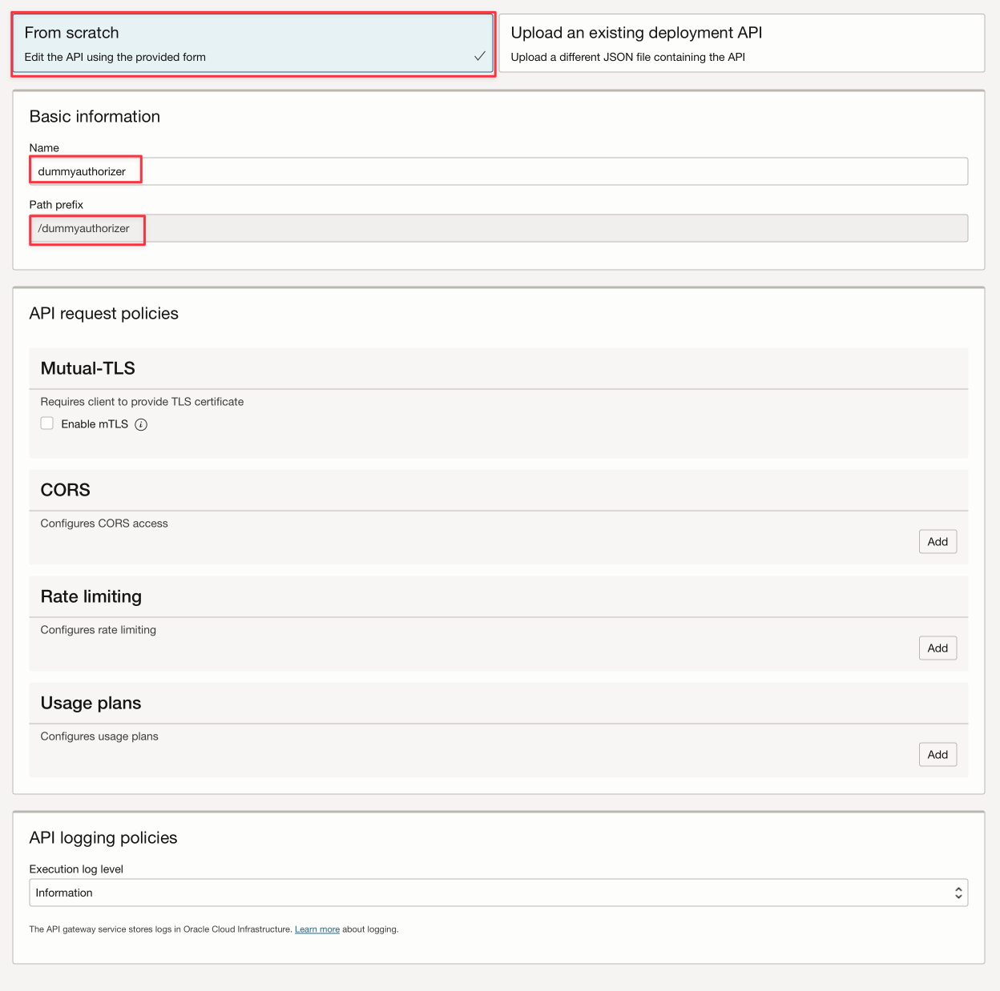

Esta demo foi baseada no material oficial de documentação da Oracle Cloud:
[Passing Tokens to Authorizer Functions to Add Authentication and Authorization to API Deployments](https://docs.oracle.com/en-us/iaas/Content/APIGateway/Tasks/apigatewayusingauthorizerfunction.htm)

Esta é a configuração do API Gateway para receber o token JWT



No OCI IDCS, a aplicação deve ser configurada dessa forma:


### O teste pode ser feito via Postman

Teste validando a autorização


Colocando o client e secret da aplicação IDCS:


Este seria o código para tratar apenas a decodificação de um JWT
```python
import io
 import json
 import logging
 import datetime
 import jwt

 from datetime import timedelta
 from fdk import response

 def handler(ctx, data: io.BytesIO = None):
     auth_token = "invalid"
     token = "invalid"
     apiKey = "invalid"
     expiresAt = (datetime.datetime.utcnow() + timedelta(seconds=60)).replace(tzinfo=datetime.timezone.utc).astimezone().replace(microsecond=0).isoformat()

     try:
         auth_token = json.loads(data.getvalue())
         token = auth_token.get("token")

         jwtTokenDecoded = jwt.decode(token, options={"verify_signature": False})

         app_context = dict(ctx.Config())
         apiKey = app_context['FN_API_KEY']

         return response.Response(
             ctx, 
             status_code=200, 
             response_data=json.dumps({"active": True, "principal": "foo", "scope": "bar", "clientId": "1234", "expiresAt": expiresAt, "context": {"username": "wally", "jwtTokenDecoded": jwtTokenDecoded}})
          )

     except (Exception, ValueError) as ex:
         logging.getLogger().info('error parsing json payload: ' + str(ex))
         pass

     return response.Response(
         ctx, 
         status_code=401, 
         response_data=json.dumps({"active": False, "wwwAuthenticate": "API-key"})
     )

```

E este seria o código validando a partir do OCI IDCS:
```python
import io
import json
import logging
import datetime
import jwt
import requests
import base64

from datetime import timedelta
from fdk import response

def handler(ctx, data: io.BytesIO = None):
    auth_token = "invalid"
    token = "invalid"
    apiKey = "invalid"
    expiresAt = (datetime.datetime.utcnow() + timedelta(seconds=60)).replace(tzinfo=datetime.timezone.utc).astimezone().replace(microsecond=0).isoformat()
    
    try:
        auth_token = json.loads(data.getvalue())
        secretID = auth_token.get("secretID")
        clientID = auth_token.get("clientID")

        auth = clientID + ":" + secretID
        auth_bytes = auth.encode("ascii")
        auth_base64_bytes = base64.b64encode(auth_bytes)
        auth_base64_message = auth_base64_bytes.decode("ascii")

        headers = {"Authorization": "Basic " + auth_base64_message, "Content-Type": "application/x-www-form-urlencoded"}

        scope = "<any scope if you have>"
        grant_type = "client_credentials"

        body = {"scope": scope, "grant_type": grant_type}

        url_post = "https://idcs-4f....................e09.identity.oraclecloud.com/oauth2/v1/token"
        post_response = requests.post(url_post, headers=headers, data=body)

        jwtTokenDecoded = jwt.decode(post_response.json()['access_token'], options={"verify_signature": False})

        return response.Response(
            ctx, 
            status_code=200, 
            response_data=json.dumps({"active": True, "principal": "foo", "scope": "bar", "clientId": "1234", "expiresAt": expiresAt, "context": {"username": "wally", "token": post_response.json()['access_token'], "jwtTokenDecoded": jwtTokenDecoded}})
         )
    
    except (Exception, ValueError) as ex:
        logging.getLogger().info('error parsing json payload: ' + str(ex))
        pass
    
    return response.Response(
       ctx, 
        status_code=401, 
        response_data=json.dumps({"active": False, "wwwAuthenticate": "API-key"})
    )


```

